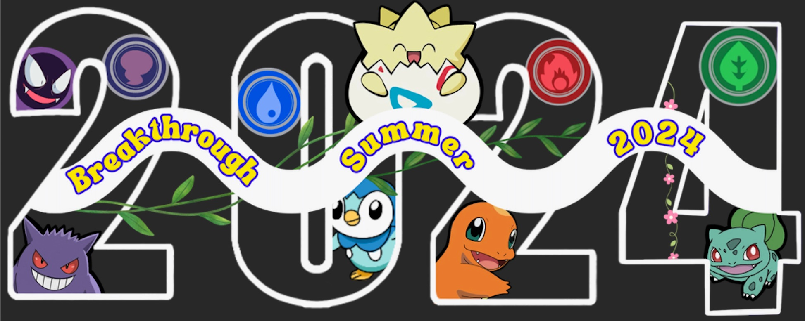

# Welcome to BTSF 8th Grade Math! 

My name is Ms. Hernandez and I am your teacher. 
I am always right(not true). 

#  Week 1: June 17-21, 2024
## Day 1-2 (June 17-18)
**Day 1-2 Objective:** Students will build their classroom culture and reflect on their identities as mathematicians.
* **No materials**
* **No Homework**

## Day 3-4 (June 20-21)
**Day 3-4 Objective:** Students will be able to calculate a missing value for a number puzzle that can be represented by a linear equation in one variable and explain a solution method. 
- [**Guided Notes**](./Forms/Day 3_4_JHMO_M8_GN_Draft-B.pdf)
- [**Number Puzzle Guide**](./Forms/Number Puzzle Guide (B).pdf) 
- [**Homework 3 PDF**](./Forms/Day 3_JHMO_M8_HW_Draft.pdf)
- **Homework Solutions**

#  Week 2: June 24-28, 2024, 2024
## Day 5-6 (June 24-25)
**Day 5-6 Objective:** 
